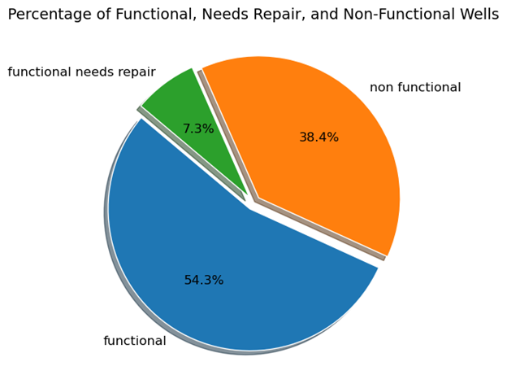
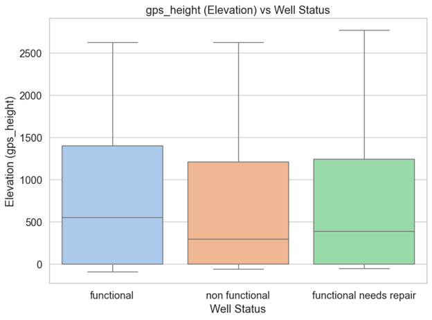
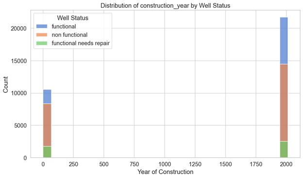
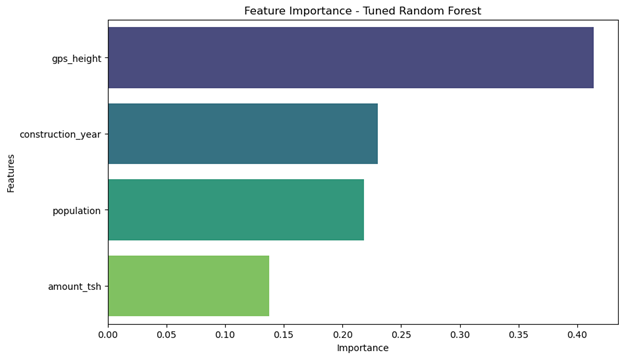
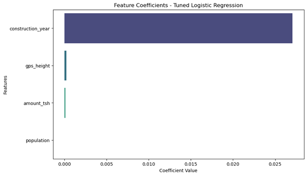
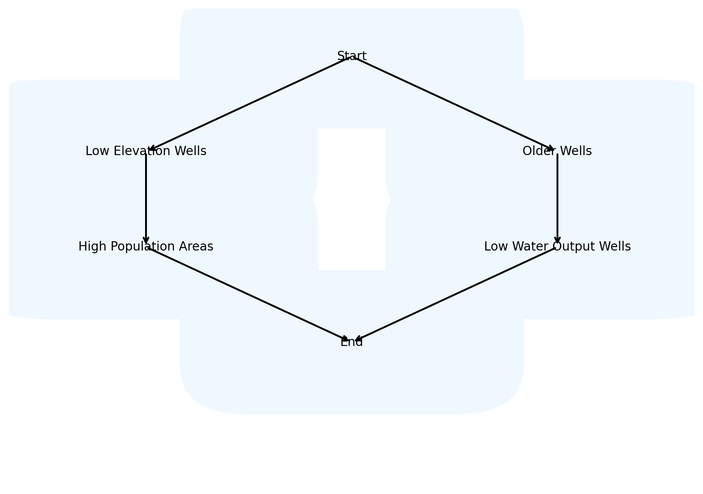
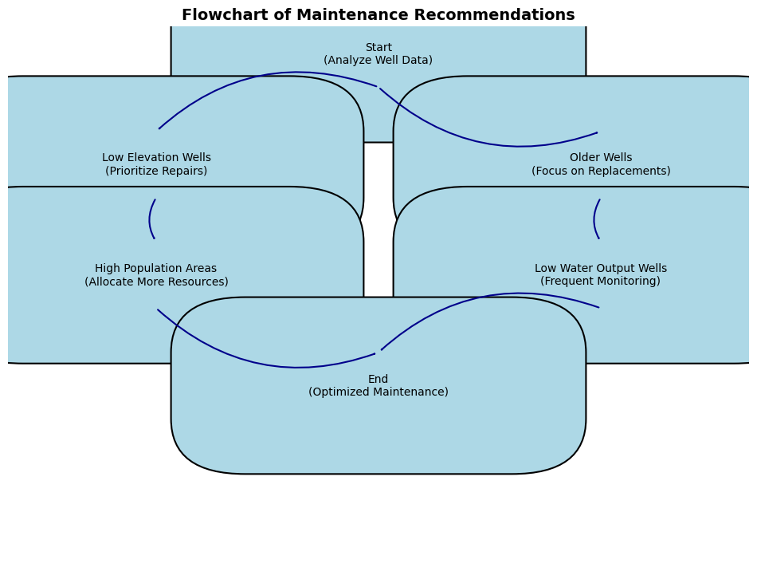

# **Tanzania Water Well Condition Classification Project**

## 🌊 Water Well Condition Analysis

## 📌 Overview
Access to clean water is essential, yet many water wells are either non-functional or require maintenance, leading to challenges in resource allocation and management. This project leverages machine learning to classify the conditions of water wells, helping prioritize repairs and optimize resource usage.

---

## 🧐 The Problem
Many communities rely on water wells, yet a significant number of these wells are either non-functional or need repairs. Limited resources make it critical to identify and prioritize maintenance.

### **Key Challenges:**
- High costs associated with manual well inspections.
- Inefficient resource allocation leading to delayed repairs.
- Impacts on community health and water accessibility.

### **Goal:**
To predict the condition of water wells (functional, needs repair, non-functional) and provide actionable insights for targeted maintenance.

---

## 🎯 Objectives
1. Develop machine learning models to classify water well conditions.
2. Identify the key factors influencing well functionality.
3. Compare multiple models to select the most accurate and efficient one.
4. Deliver actionable recommendations to stakeholders.

---

## 📊 Dataset Overview
The dataset consists of information about 59,400 wells and includes 40 features such as:
- **gps_height**: Elevation of the well.
- **population**: Population dependent on the well.
- **amount_tsh**: Total static head (water level).
- **construction_year**: Year the well was constructed.

### **Target Variable:**  
- **status_group**: Categorized as:
  - `Functional`
  - `Needs Repair`
  - `Non-Functional`

### **Data Preparation:**
- Addressed missing values.
- Encoded non-numeric features.
- Ensured data quality for accurate modeling.

---

## 📈 Exploratory Data Analysis (EDA)
### **Key Insights:**
1. Wells at lower elevations (`gps_height`) are more likely to fail.
2. Older wells (constructed before 2000) have higher failure rates.
3. High population areas contribute to increased wear and tear.
4. Wells with low water output (`amount_tsh`) are prone to frequent failures.

### **Visualizations:**
- **Pie Chart:** Distribution of well conditions.

     
     

- **Scatter Plot:** `gps_height` vs. `status_group`.

     

- **Histogram:** Distribution of `construction_year` with well conditions overlaid.

    
---

## 🔗 Feature Importance
### **Top Features Influencing Well Conditions:**
1. **gps_height**: Elevation of the well.
2. **construction_year**: Age of the well.
3. **population**: Number of users relying on the well.
4. **amount_tsh**: Water output.

### **Visualization:**
- **Feature Importance Plot:** Highlights the contributions of each feature based on Random Forest and Logistic Regression models.

   
   

---

## 🤖 Machine Learning Models
Three models were tested and compared to identify the best classifier:
1. **Decision Tree**
2. **Logistic Regression**
3. **Random Forest**

### **Evaluation Metrics:**
- **Accuracy:** Measures overall correctness of predictions.
- **F1 Score:** Balances precision and recall, particularly useful for imbalanced data.

### **Results:**
| Model               | Accuracy | F1 Score |
|---------------------|----------|----------|
| Decision Tree       | 0.58     | 0.56     |
| Logistic Regression | 0.60     | 0.59     |
| Random Forest       | 0.63     | 0.61     |

**Best Model:**  
- **Random Forest**: Achieved the highest accuracy and F1 score. It is robust to outliers and handles complex feature interactions effectively.

---

## ⚠️ Limitations of the Models

While the models used in this project effectively predicted water well conditions, there are specific limitations observed when applied to this dataset and problem:

### **1. Decision Tree**
- **Overfitting on Complex Patterns**:  
  The Decision Tree model captured the specific details of the training data too closely, leading to overfitting. This resulted in poorer performance on unseen wells, especially those from underrepresented regions.
- **Simplistic Feature Relationships**:  
  The model struggled to account for nuanced interactions between features like `gps_height` and `population`, reducing its ability to generalize.

---

### **2. Logistic Regression**
- **Assumption of Linearity**:  
  Logistic Regression assumes a linear relationship between features (e.g., `gps_height`, `construction_year`) and the target. However, the dataset contains complex, non-linear relationships that the model could not fully capture.
- **Difficulty Handling Multi-Class Target**:  
  While Logistic Regression was adapted for multi-class classification (functional, needs repair, non-functional), it did not handle overlapping feature distributions as effectively as Random Forest.
- **Feature Scaling Dependency**:  
  The model's reliance on scaled features added preprocessing complexity, and minor scaling issues impacted performance.

---

### **3. Random Forest**
- **High Computational Cost**:  
  Random Forest required significant time and resources to train due to the size of the dataset (59,400 wells) and the number of features (40). This can pose challenges for scalability if the dataset grows.
- **Bias Toward Numerical Features**:  
  Features like `gps_height` and `amount_tsh` dominated the importance rankings, potentially overshadowing categorical features like `region`. This bias could result in missing critical patterns from categorical data.
- **Interpretability Challenges**:  
  While Random Forest achieved the best accuracy, explaining its individual predictions (e.g., why a specific well was classified as non-functional) was not straightforward, which may limit its utility for some stakeholders.

---

### **General Limitations for This Project**
1. **Imbalanced Data**:  
   The dataset had a higher proportion of functional wells compared to wells needing repair or non-functional wells, which led to challenges in achieving high recall for the minority classes.
2. **Geographic Bias**:  
   Certain regions had more data points, resulting in models performing better for wells in those areas while underperforming in less-represented regions.
3. **Missing Data Impact**:  
   Although missing values were handled, imputation might have introduced noise, particularly for critical features like `amount_tsh` and `population`.
4. **Dynamic Changes in Conditions**:  
   The model assumes static well conditions, but real-world factors like seasonal variations or sudden failures were not accounted for.

---

### **Project-Specific Recommendations to Address Limitations**
1. **Overcome Overfitting**: Used techniques like tree pruning (Decision Tree) and hyperparameter tuning (Random Forest).
2. **Capture Non-Linear Patterns**: There's a need to Explore advanced models like Gradient Boosting or Neural Networks for better handling of non-linear relationships.
3. **Balance the Dataset**: Applying resampling techniques (e.g., SMOTE) or using class weights to address the imbalance between functional and non-functional wells.
4. **Enhance Data Collection**: Gather more data from underrepresented regions and improve the quality of features like `amount_tsh` to reduce imputation noise.
5. **Add Temporal Data**: Incorporate time-based features to account for dynamic changes in well conditions.

---

By addressing these limitations, future iterations of this project can further enhance predictive accuracy and the practical utility of the models for stakeholders.

## 💡 Actionable Insights
### **Recommendations for Maintenance:**
1. **Low Elevation Wells**: Prioritize repairs for wells in lower elevation areas.
2. **Older Wells**: Focus on wells constructed before 2000 for potential replacements.
3. **High Population Areas**: Allocate more resources to regions with higher population demands.
4. **Low Water Output Wells**: Implement frequent monitoring for wells with low `amount_tsh`.

### **Visual:**  
- Flowchart summarizing maintenance priorities and strategies.

   
   

---

## 🔮 Final Predictions
Using the Random Forest model, predictions for well statuses were generated on new data and saved for stakeholder review.

### **Sample Output:**
| Well ID | gps_height | construction_year | amount_tsh | population | Predicted Status |
|---------|------------|--------------------|------------|------------|------------------|
| 12345   | 1250       | 1998              | 50         | 300        | Functional       |
| 67890   | 400        | 1980              | 0          | 1200       | Non-Functional   |

---

